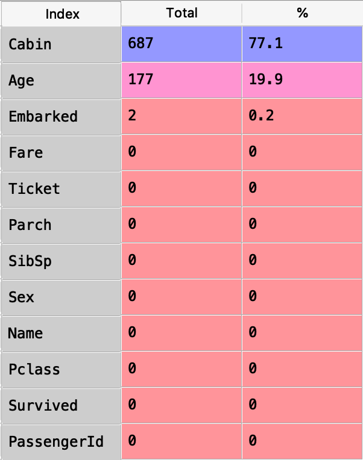

# Titanic-ML-PredictiveModel
This repository will store my project which predicts the death of people on the Titanic using the Titanic Dataset from Kaggle.

## Kaggle
The link to the kaggle competition: https://www.kaggle.com/c/titanic/overview

## Starting the Predictive Model
I have added the Data Analyses python file. This file runs some analysis and draws graphs to show which columns should be used for the predictive models.

## Data Analysis
To start off I had to look at the actual training dataset to get a feel of what type of data I would be working with.

#### This shows the First 5 Rows of the Dataset:

### Analysis on Gender/Age:

To start off analysing this dataset I needed to decide what variables I would like to look at first. 
The __First__ set of varibales I looked at were Age and Sex
I used the data to create two histograms, one for **Male** and one for **Female**.
They both show Survival rate with the **Age** on the x-Axis.

Looking at the histograms we can see that:
 * More female passengers survived than male
 * Lower survival rate for male passengers between the age of 15-30 
 * Higher survival rate for female passengers between the ages of 15-40

### Analysis on Survived/Pclass/Gender/Embarked:

The second analysis that I carried out on the dataset was using the **Survived/Pclass/Gender/Embarked** variables. This is comparing how the class of the ticket to the survival rate of both female and male. Whilst also showing this from the three different ports that the Titanic stopped at. 

#### First Graph:

<table>
 
 
     
 

 

  <tr>
   <ul> Looking at the graphs to left we can see that:
    <li> Females that embarked at ports S and Q had a higher probabilty to survive compare to port C where men had a higher            probability to survive
    <li> Overall the first class ticket holders had a higher chance of survival compared to the other classes 
  </ul>
  </tr>
 

</table>

#### Second Graph:
<table>
 
 
  
 

 

  <tr>
   <ul> Looking at the graph to the left:
    <li> The most of the passengers that didnt survive came from the 3rd class
    <li> Out of the passengers that survived most were the 1st class and the second most was the 3rd class
   </li>
  </tr>
 

</table>
 
 
 
## Data Preprocessing

One of the main things I had to consider was data preprocessing. The raw data provided for this project was no where near ready to be put into a ML model and used to predict anything just yet. 

### Null Values

My first course of action was to find how many null/NaN values there were in this dataset, I made a new dataframe which had all the null values for the training data for each column:

Looking above at the dataframe we can see that **Cabin** had the most null values with 687 which is 77.1% of the total data for that column. **Age** also has a significant value of nulls with 177 which is 19.9% of the total data for that column. The **Cabin** column has nearly 80% of the values missing and the **PassengerId** column will not affect the outcome of the predictions so I decided to exclude both of the columns from my training data.

#### Age

To deal with the **Age** column which has 177 values missing I decided to calculate the mean and the standard deviation of the age column and then generate random numbers which are focused around those results to fill in the null values. This is done through a simple for loop which uses both the training and test data to fill in the blanks with the numpy library randint function. 

#### Embarked

As there are only 2 values for the **Embarked** column it is best to fill those two values in with the most common port that people embarked on. That port is port "S" which was found through the .describe() function. 
