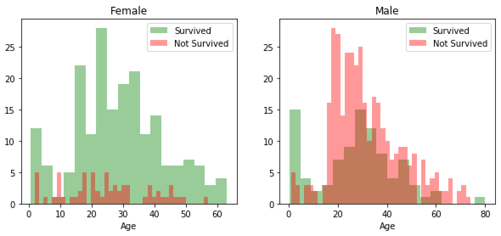
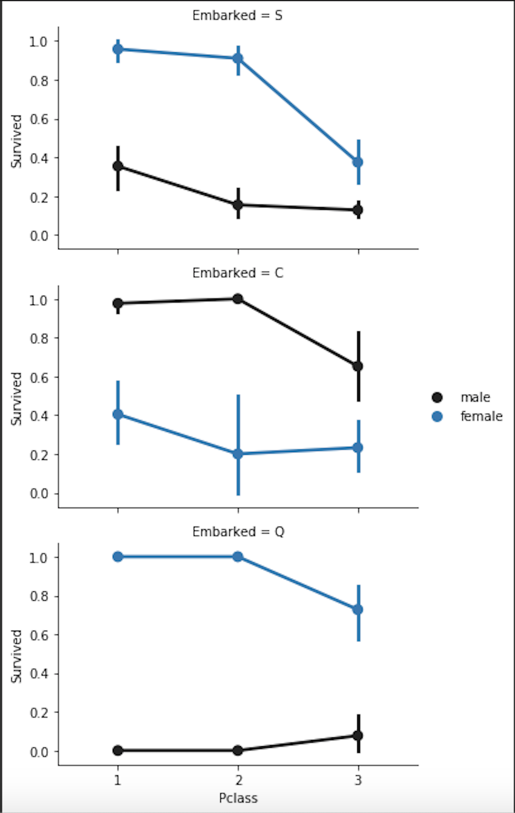
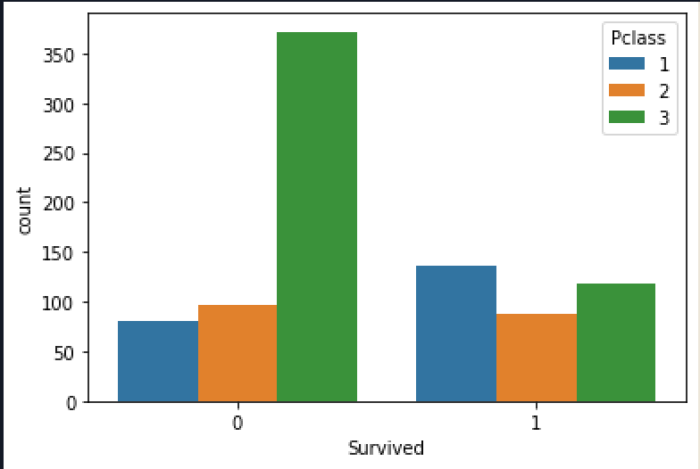

# Titanic-ML-PredictiveModel
This repository will store my project which predicts the death of people on the Titanic using the Titanic Dataset from Kaggle.

# Kaggle
The link to the kaggle competition: https://www.kaggle.com/c/titanic/overview

# Starting the Predictive Model
I have added the Data Analyses python file. This file runs some analysis and draws graphs to show which columns should be used for the predictive models.

# Data Analysis
To start off I had to look at the actual training dataset to get a feel of what type of data I would be working with.

#### This shows the First 5 Rows of the Dataset:

## Analysis on Gender/Age:

To start off analysing this dataset I needed to decide what variables I would like to look at first. 
The __First__ set of varibales I looked at were Age and Sex
I used the data to create two histograms, one for **Male** and one for **Female**.
They both show Survival rate with the **Age** on the x-Axis.

Looking at the histograms we can see that:
 * More female passengers survived than male
 * Lower survival rate for male passengers between the age of 15-30 
 * Higher survival rate for female passengers between the ages of 15-40

## Analysis on Survived/Pclass/Gender/Embarked:

The second analysis that I carried out on the dataset was using the **Survived/Pclass/Gender/Embarked** variables. This is comparing how the class of the ticket to the survival rate of both female and male. Whilst also showing this from the three different ports that the Titanic stopped at. 

#### First Graph:

<table>
 
 
     
 

 

  <tr>
   <ul> Looking at the graphs above we can see that:
    <li> Females that embarked at ports S and Q had a higher probabilty to survive compare to port C where men had a higher            probability to survive
    <li> Overall the first class ticket holders had a higher chance of survival compared to the other classes 
  </ul>
  </tr>
 

</table>

<h4 class='title'>Second Graph:</h4>
 
 
  
 

 
