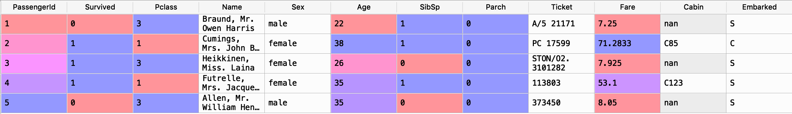

# Titanic-ML-PredictiveModel
This repository will store my project which predicts the death of people on the Titanic using the Titanic Dataset from Kaggle.

# Kaggle
The link to the kaggle competition: https://www.kaggle.com/c/titanic/overview

# Starting the Predictive Model
I have added the Data Analyses python file. This file runs some analysis and draws graphs to show which columns should be used for the predictive models.

# Data Analysis
To start off I had to look at the actual training dataset to get a feel of what type of data I would be working with.

#### This shows the First 5 Rows of the Dataset:

To start off analysing this dataset I needed to decide what variables I would like to look at first. 
The __First__ set of varibales I looked at were: Age and Sex
I used the data to create two histograms, one for **Male** and one for **Female**.
They both show Survival rate with the **Age** on the x-Axis.

#### This graph shows the first analysis on Gender/Age:

